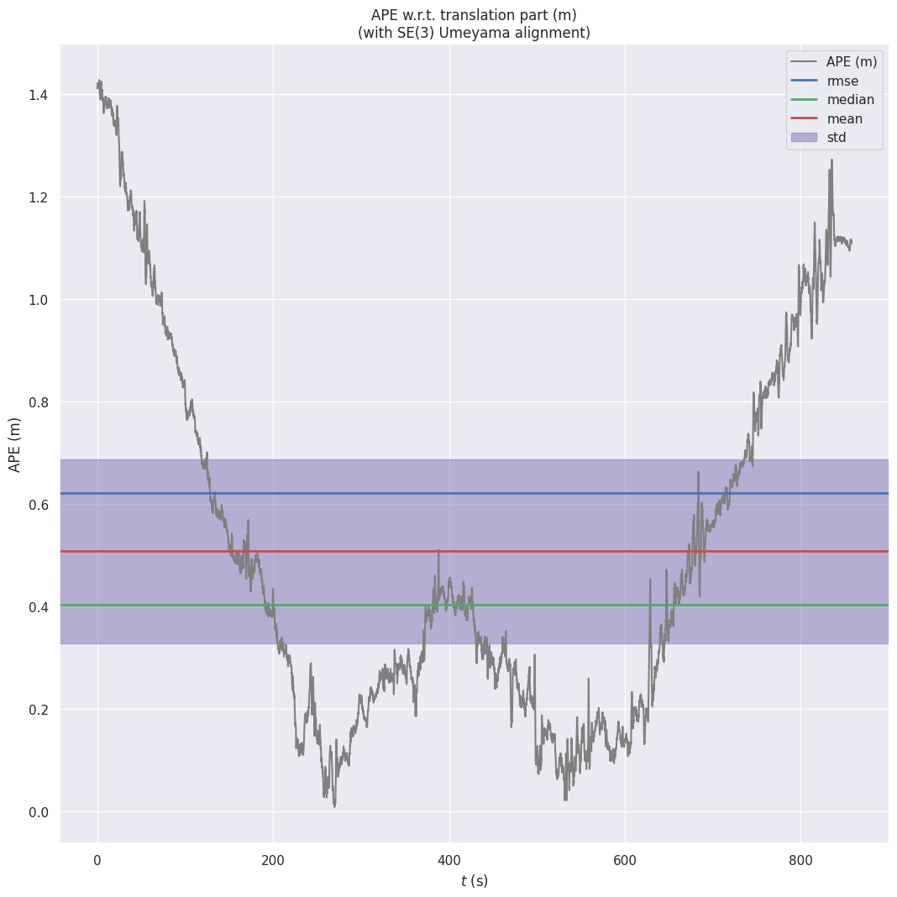
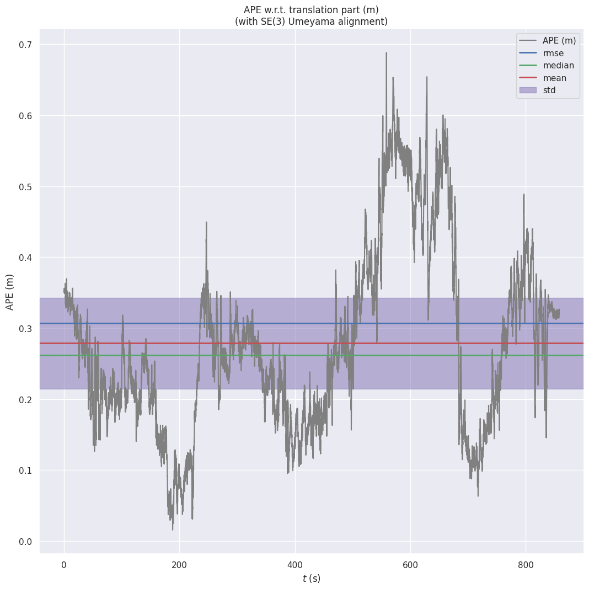
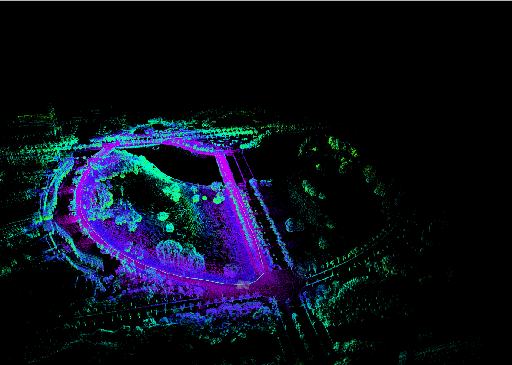
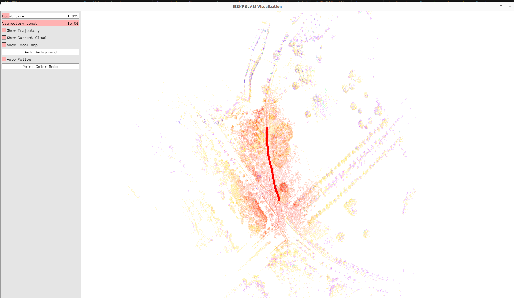

# I-RIKF-LIO

**Personal learning project** — similar to Fast-LIO2, based on Eigen library, implementing **laser-inertial odometry** using:

- Iterated Right-Invariant Kalman Filter (IRIKF) — **removed** due to unstable implementation  
- Iterated Error State Kalman Filter (IESKF, under development)

> ⚠️ **Warning:** Bad coding skills. This project is messy. Use with caution.

---

## Comparison Result

| Faster LIO | I-RIKF |
|------------|--------|
|  |  |

**Map:**  

**Pangolin Viewer:**  

---

## TODO

- [x] Add `time_unit` adaptation for Velodyne  
- [x] Save trajectory and map  
- [x] Implement iterated version of Right-Invariant Kalman Filter  
- [x] Add Pangolin support, remove RViz (RViz optional)  
- [x] Add IKdtree for improved real-time performance (some code cleaning pending)  
- [x] Add loop closure to improve global consistency (branch `dev/loop`)  
- [ ] Add extrinsic estimation (probably not doing this)

---

## Acknowledgments

A big thanks to [mengkai98/ieskf_slam](https://github.com/mengkai98/ieskf_slam) for the detailed tutorial and excellent code — this project is built based on his work.
